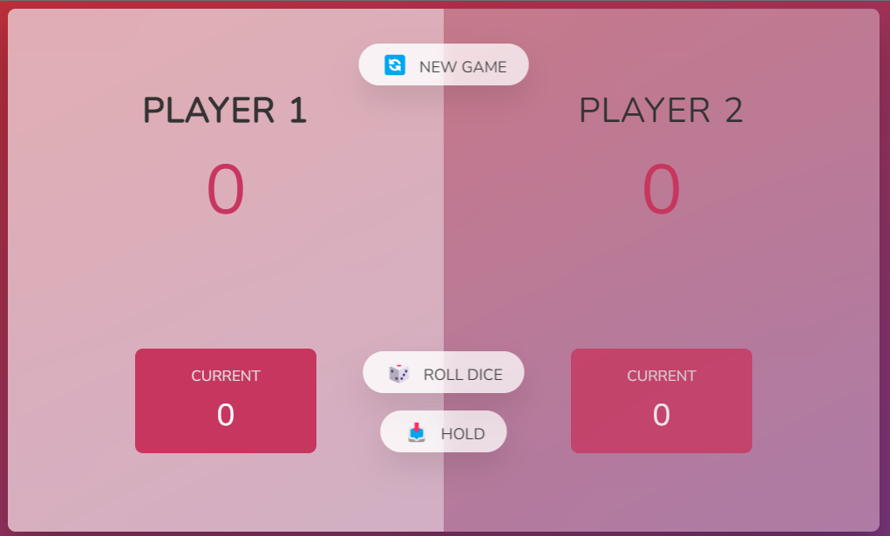

## Projeto de um Jogo para ver quem consegue acumular mais porntos primeiro
Teste o app - <a href="https://thander21.github.io/TCJ-Pig-Game/" target="_blank">https://thander21.github.io/TCJ-Pig-Game/</a>

**O que é o Pig Game**

É um jogo de dados de 2 jogadores para ver quem acumula 100 pontos primeiro
As regras são simples, cada jogardor tem sua rodada pode se jogar os dados quantas vezes quiser e ir somando os numeros, se tirar 1 os pontos  da rodada zeram e passam a vez, quando quiser parar a rodada, acumula os pontos salvos sem perder e passam a vez

**Projeto feito passo a passo**

- HML e CSS, pronto, sem modificação
- 

**Criação Personalizada**

- O javascript (vanilla) feito somente com o descrito do desafio sem passo a passo sem consltas.
